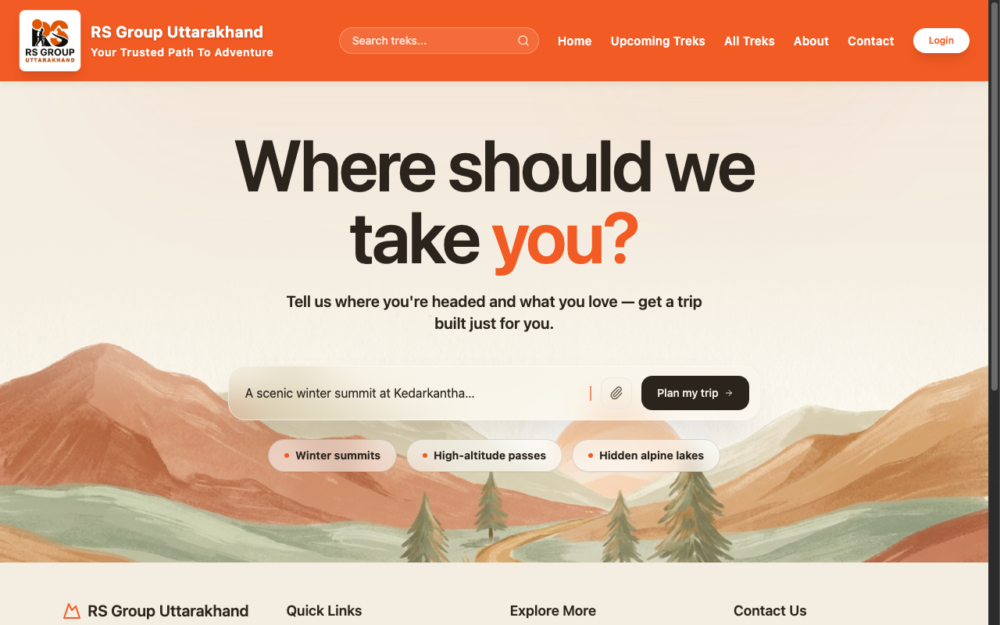
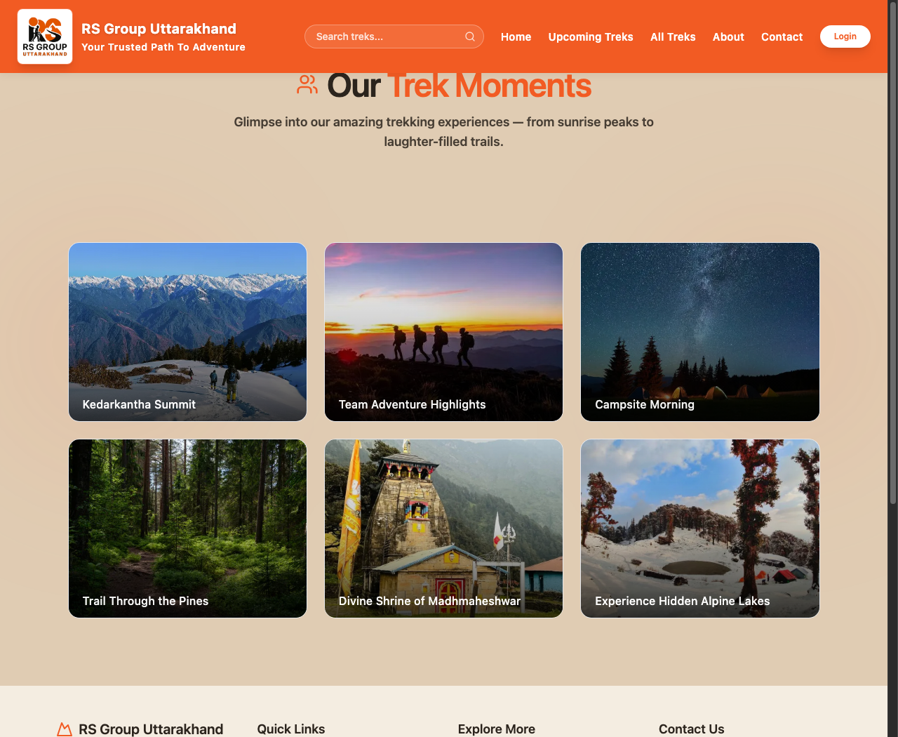

# RS Group Uttarakhand

**Your Trusted Path to Adventure**

RS Group Uttarakhand is an adventure and tourism platform designed to help people discover trekking, outdoor activities, events, and memorable experiences across the beautiful landscapes of Uttarakhand.

The platform brings together adventure seekers and curated Himalayan experiences while promoting responsible and sustainable tourism.

## About the Project

RS Group Uttarakhand provides a simple and engaging way for users to:

-  Explore trekking experiences
-  Discover upcoming and available treks
-  Search for treks, events, sports, and activities
-  Explore nature and outdoor adventures
-  Plan customized trips
-  Learn about community and environmental initiatives
-  Get in touch with the team
-  Access the user login section

## Key Features

### Trek & Adventure Discovery
Browse different trekking and adventure experiences available across Uttarakhand.

### Smart Search
Search for trekking routes, events, sports, and outdoor activities from the main navigation bar.

### Upcoming Treks
A dedicated section for discovering upcoming trekking opportunities and planning your next adventure.

### Customized Trips
Users can share their interests and preferred destinations to plan an experience suited to their needs.

### Sustainable Tourism
The platform highlights initiatives focused on supporting Himalayan communities, environmental protection, clean-up drives, and responsible travel.

### Community & Partnerships
Showcases contributions, certifications, trusted partners, and community-focused programs.

### Easy Contact
Quick-access WhatsApp and phone contact options make it easier for visitors to connect with the organization.

## Website Sections

- **Home** – Introduction and featured adventures
- **Upcoming Treks** – Upcoming trekking experiences
- **All Treks** – Explore available trekking options
- **About** – Learn more about RS Group Uttarakhand
- **Contact** – Connect with the team
- **Login** – User authentication area

## Website Preview

### Custom Trip Planner

The customized trip planning section allows visitors to describe the kind of adventure they are looking for and explore options such as winter summits, high-altitude passes, and hidden alpine lakes.



### Our Trek Moments

A visual gallery showcasing memorable RS Group Uttarakhand experiences, including Kedarkantha Summit, team adventures, campsites, forest trails, Madhmaheshwar, and alpine lakes.



## Technologies

The project is developed as a modern web application using:

- HTML5
- CSS3
- JavaScript
- Responsive Web Design

> Add or update this section if your project uses additional frameworks, libraries, APIs, or backend technologies.

## Project Goals

The main goals of RS Group Uttarakhand are to:

1. Make Himalayan adventures easier to discover.
2. Provide an engaging platform for trekking and outdoor experiences.
3. Encourage responsible and sustainable tourism.
4. Support local Himalayan communities.
5. Connect adventure enthusiasts with memorable experiences in Uttarakhand.

## Our Vision

To become a trusted digital platform for discovering the beauty, adventure, and culture of Uttarakhand while encouraging travelers to explore responsibly and leave a positive impact on the mountains and local communities.

## Getting Started

Clone the repository:

```bash
git clone <your-repository-url>
```

Navigate to the project directory:

```bash
cd <project-folder>
```

Open the project in your preferred code editor and launch the website using a local development server.

For a simple static website, you can also open `index.html` directly in a browser.

## Suggested Project Structure

```text
RS-Group-Uttarakhand/
│
├── index.html
├── about.html
├── treks.html
├── upcoming-treks.html
├── contact.html
├── login.html
│
├── css/
│   └── style.css
│
├── js/
│   └── script.js
│
├── images/
│   └── ...
│
└── README.md
```

## Contributing

Contributions and suggestions are welcome.

1. Fork the repository.
2. Create a new branch.
3. Make your changes.
4. Commit your changes.
5. Push the branch.
6. Open a Pull Request.

## Contact

**RS Group Uttarakhand**  
*Your Trusted Path to Adventure*

For trek bookings, customized trips, collaborations, or general enquiries, use the contact options available on the website.

## License

This project is developed for **RS Group Uttarakhand**.  
Add the appropriate license here if the project is intended to be open source.

---

### Explore. Experience. Preserve.

**Your Trusted Path to Adventure.**
